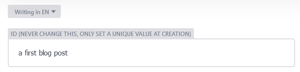

# minimal [CMS](/admin/) documentation

## Set a unique ID, only at creation

Pages that can be created from the CMS have an ID field which allows them to be referenced from other pages. That's how the home page can display a list of blog posts.

When you create an id, make sure that it is unique. If two blog posts have the same id, a page that wants to reference one of them will have to display both.

Never change the ID field, because the references to it from other pages would not be updated.

## The ID determines the url

The value of the ID field at creation is used to create the url where the page will be found. After creation, the url will not change. If you want another url, you need to create another page and delete the first one.

